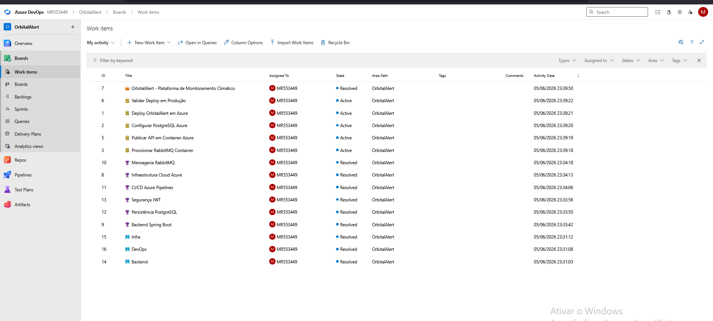
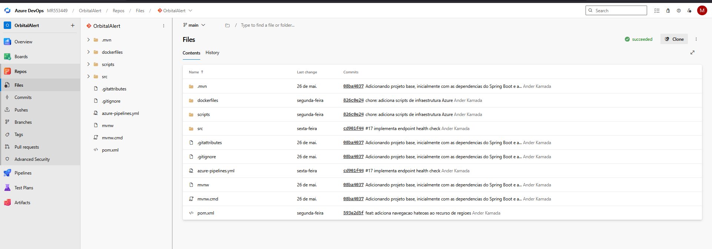
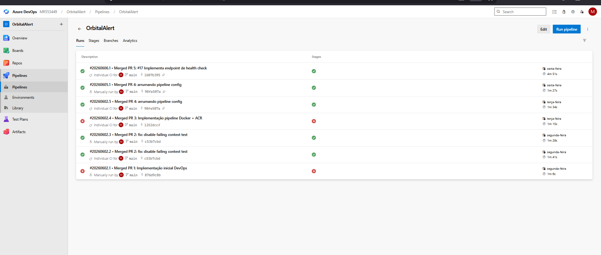
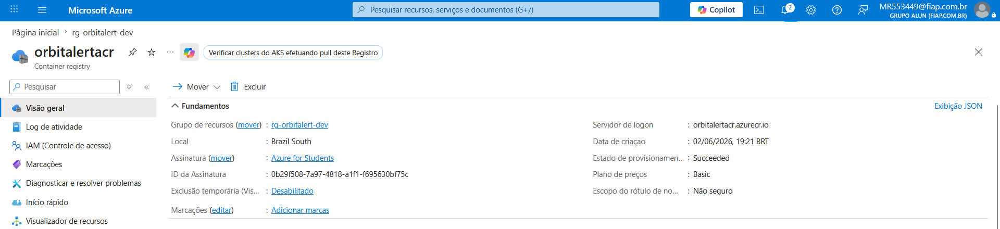
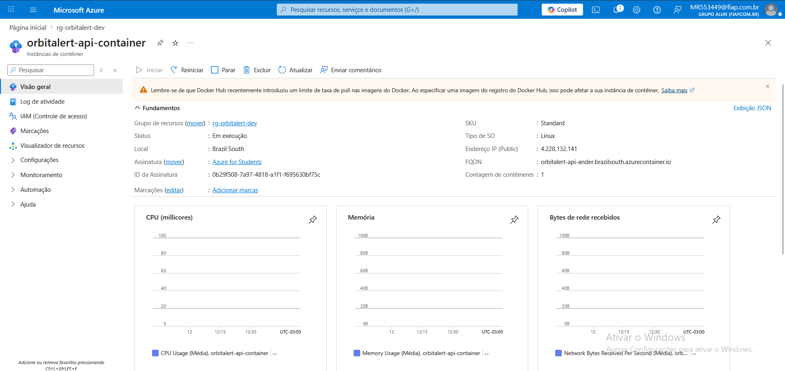
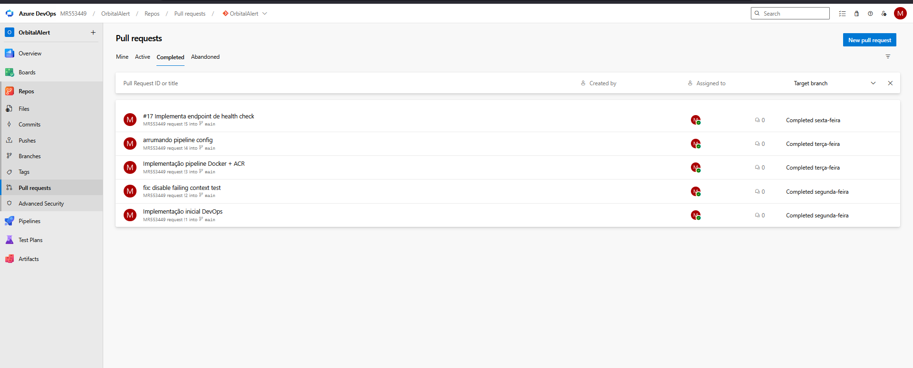
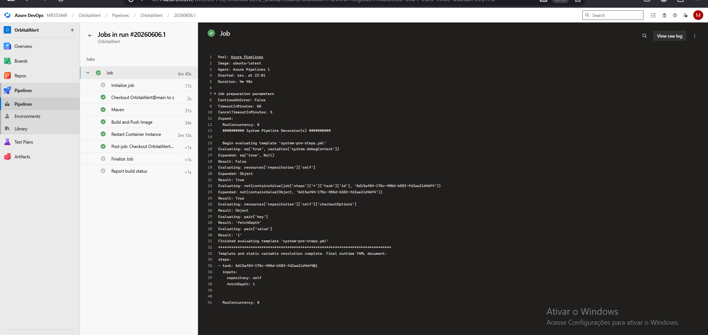
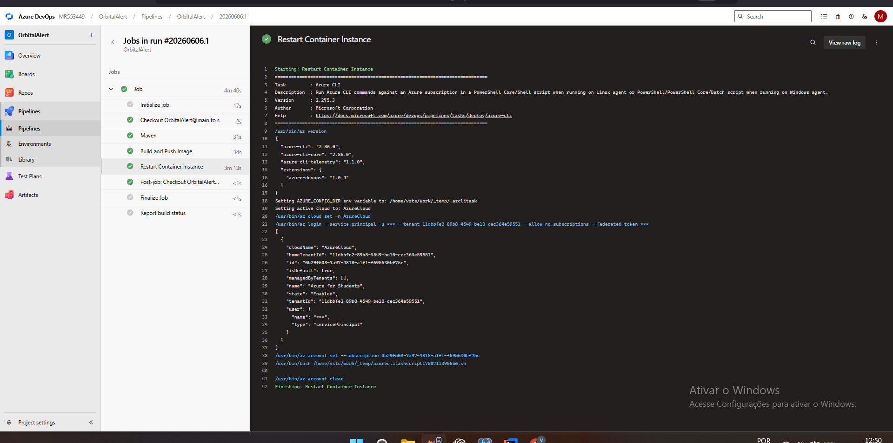

# OrbitalAlert

## Global Solution 2026 - FIAP

Sistema inteligente de monitoramento climático desenvolvido para auxiliar na análise de riscos ambientais, monitoramento de regiões e emissão de alertas preventivos com base em dados meteorológicos.

---

## Integrantes

| Nome         | RM       |
| ------------ | -------- |
| Ander Kamada | MR553449 |

---

# Problema

Eventos climáticos extremos têm causado impactos cada vez maiores em áreas urbanas e rurais. A falta de monitoramento integrado e de mecanismos automatizados de análise dificulta ações preventivas e aumenta os riscos para a população.

---

# Solução

O OrbitalAlert é uma plataforma baseada em Spring Boot que permite:

* Cadastro de regiões monitoradas
* Consulta de informações climáticas
* Análise automática de riscos
* Geração de alertas
* Integração assíncrona utilizando RabbitMQ
* APIs REST documentadas
* Implantação automatizada em nuvem Azure

---

# Tecnologias Utilizadas

## Backend

* Java 21
* Spring Boot
* Spring Data JPA
* Spring Security
* JWT Authentication
* Swagger / OpenAPI

## Banco de Dados

* PostgreSQL

## Integração

* RabbitMQ
* Open-Meteo API

## DevOps

* Azure DevOps
* Azure Boards
* Azure Repos
* Azure Pipelines
* Docker
* Azure Container Registry (ACR)
* Azure Container Instance (ACI)

---

# Arquitetura da Aplicação


### Descrição

A solução foi desenvolvida utilizando Spring Boot com autenticação JWT e arquitetura baseada em APIs REST.

A aplicação integra-se ao PostgreSQL para persistência de dados, RabbitMQ para mensageria assíncrona e Open-Meteo para obtenção de dados climáticos externos.

Um microsserviço de alertas consome mensagens enviadas pela aplicação principal e realiza o processamento dos eventos gerados.

---

# Arquitetura DevOps


### Descrição

O fluxo DevOps utiliza:

* Azure Boards para gerenciamento das tarefas
* Azure Repos para versionamento
* Azure Pipelines para Integração Contínua (CI)
* Azure Container Registry para armazenamento das imagens Docker
* Azure Container Instance para hospedagem da aplicação

Após um Pull Request aprovado e mergeado na branch principal, a pipeline é executada automaticamente realizando build, publicação da imagem Docker e atualização da aplicação em nuvem.

---

# Estrutura do Projeto

```text
orbitalert-api
│
├── dockerfiles
│   └── Dockerfile
│
├── scripts
│   ├── script-bd.sql
│   └── script-infra.sh
│
├── src
│   ├── controller
│   ├── service
│   ├── repository
│   ├── model
│   ├── security
│   ├── dto
│   └── config
│
├── azure-pipelines.yml
│
└── pom.xml
```

---

# Banco de Dados

O banco de dados utilizado é PostgreSQL hospedado em ambiente Azure.

O script de criação das tabelas encontra-se em:

```text
scripts/script-bd.sql
```

Tabelas principais:

* tb_regiao
* tb_usuario

---

# Infraestrutura Azure

A infraestrutura é provisionada utilizando Azure CLI.

Script disponível em:

```text
scripts/script-infra.sh
```

Recursos criados:

* Resource Group
* Azure Container Registry
* Azure Container Instance
* PostgreSQL
* RabbitMQ

---

# Pipeline CI/CD

A solução utiliza Azure Pipelines para automação do processo de build e deploy.

Fluxo:

1. Criação da Task no Azure Boards
2. Criação de Branch
3. Alteração do código-fonte
4. Commit vinculado ao Work Item
5. Pull Request
6. Aprovação
7. Merge na Main
8. Execução automática da Pipeline
9. Build Maven
10. Build da imagem Docker
11. Push para Azure Container Registry
12. Deploy automático no Azure Container Instance

---

# Endpoints

## Health Check

```http
GET /regioes/health
```

Resposta:

```json
"OrbitalAlert API Online"
```

---

## Região

### Criar Região

```http
POST /regioes
```

```json
{
  "nome": "São Paulo",
  "cidade": "São Paulo",
  "nivelRisco": "ALTO"
}
```

### Listar Regiões

```http
GET /regioes
```

### Buscar Região por ID

```http
GET /regioes/1
```

---

## Alertas

### Criar Alerta

```http
POST /alertas
```

```json
{
  "mensagem": "Risco de enchente",
  "nivel": "ALTO"
}
```

### Listar Alertas

```http
GET /alertas
```

### Teste RabbitMQ

```http
POST /alertas/teste
```

Resposta:

```json
"Mensagem enviada"
```

---

## Análise de Risco

### Analisar Risco

```http
POST /risco/analisar
```

```json
{
  "temperatura": 35,
  "umidade": 85,
  "velocidadeVento": 20
}
```

---

# Azure DevOps

## Organização

https://dev.azure.com/MR553449

## Projeto

https://dev.azure.com/MR553449/OrbitalAlert

## Repositório

https://dev.azure.com/MR553449/OrbitalAlert/_git/OrbitalAlert

## Pipeline

https://dev.azure.com/MR553449/OrbitalAlert/_build

---

# Evidências

* Azure Boards

* Azure Repos

* Azure Pipelines

* Azure Container Registry

* Azure Container Instance

* Pull Request

* Build executado com sucesso

* Deploy executado com sucesso

---

# Vídeo Demonstração

Link do vídeo:


---

# Autor

Ander Kamada

RM553449

Global Solution 2026 - FIAP
